## Syntiant-TinyML 语言识别实验

一定要先看**参考教程**：

1、https://docs.edgeimpulse.com/docs/tutorials/hardware-specific-tutorials/responding-to-your-voice-syntiant-rc-commands-go-stop

2、[基于最新理念TinyML – 生成官方go-stop模型软件 - 哔哩哔哩 (bilibili.com)](https://www.bilibili.com/read/cv13357192?spm_id_from=333.999.list.card_article.click)   这个up主的视频可以看看

**此处我不在重复叙述教程步骤，我这里只是记录我的使用过程！**

#### 1、连续说几个关键词的方案选择，此处参考硬禾学堂的教学直播视频给的建议选取的关键词

​	1.1、一口气说完关键词。建议四个字的关键字短语

​			关键词选择 开启绿灯、开启红灯、蓝灯点亮、关闭指示灯。

​	1.2、关键词分开说，先说”siri“，给个标志位打开-flag_siri=1，随后再说”开灯“这个关键词同时对应标志位open_led=1，在flag_siri = 1的情况下开灯，如果否则为关灯。如表格所示

| flag_siri | open_led | 识别结果 |
| --------- | -------- | -------- |
| 0         | 0        | 保持     |
| 0         | 1        | 保持     |
| 1         | 0        | 保持     |
| 1         | 1        | 开灯     |

关键词方案选择1.1。

随后新建工程选择对应的开发板syntiant开发板，按照参考教程的采集数据和设置参数和生成模型。

#### 2、采集数据，我使用的是手机的方式进行数据采集

​	点击show QR code 之后会出现二维码，使用手机或者平板都可以扫码登陆授权使用麦克风。设计标签之后，同时采集的**语音数据长度为10s**，label：标签自定义，类别选择：Split automaticlly(80/20)，含义是采集的语音数据软件自动帮你分配，80%的语音集为training，20%的语音集用于testing。

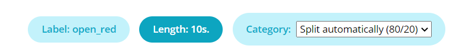

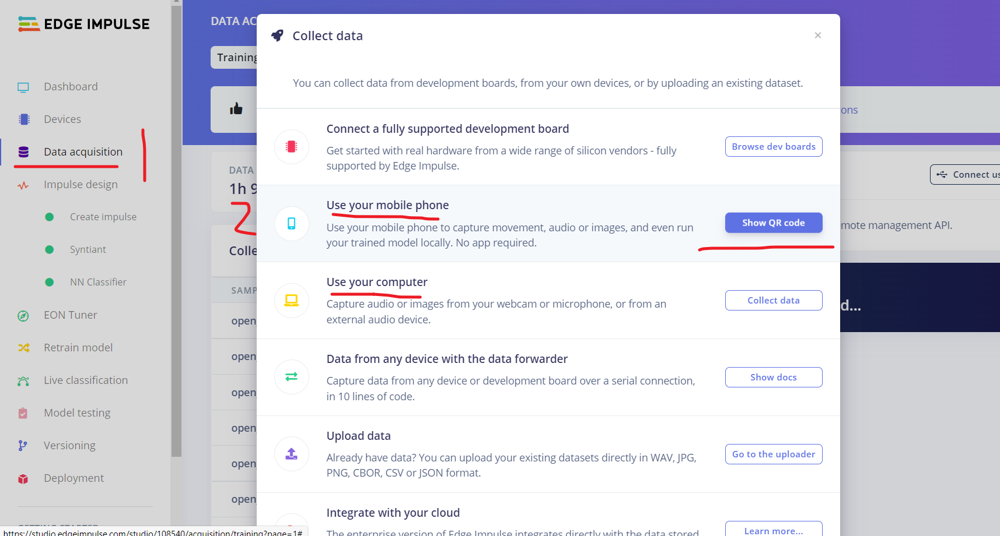

采集之后的语音数据可自行分割选取合适的语音数据

参考教程：[响应您的声音 - Syntiant - RC 命令 - 边缘脉冲文档 (edgeimpulse.com)](https://docs.edgeimpulse.com/docs/tutorials/hardware-specific-tutorials/responding-to-your-voice-syntiant-rc-commands-go-stop)

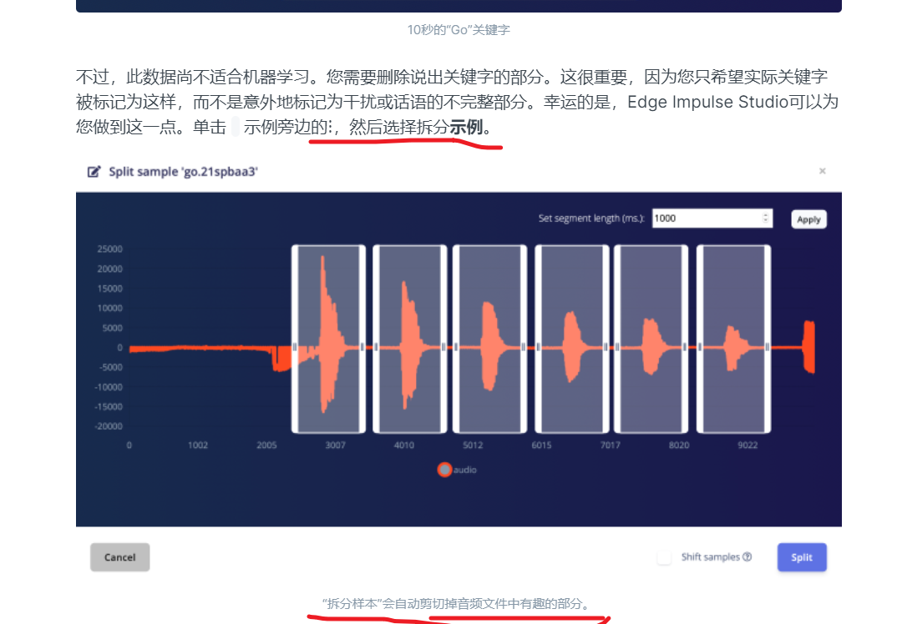

可按照参考教程给出的数据集拆分的方式进行对数据处理。

#### 4、将训练的模型导出并且使用falsh的形式下载开发板之后进行测试

##### 	4.1运行自己训练的edge-impulse项目模型在开发板里面

一定要先看参考文档：[On your Syntiant TinyML Board - Edge Impulse Documentation](https://docs.edgeimpulse.com/docs/deployment/running-your-impulse-locally/on-your-syntiant-tinyml-board)

默认已经可以生成构件固件-Syntiant TinyML的固件文件-点击绿色按键”build“一定要看configure posterior parameters这个选项的Find posterior parameters是否已经训练

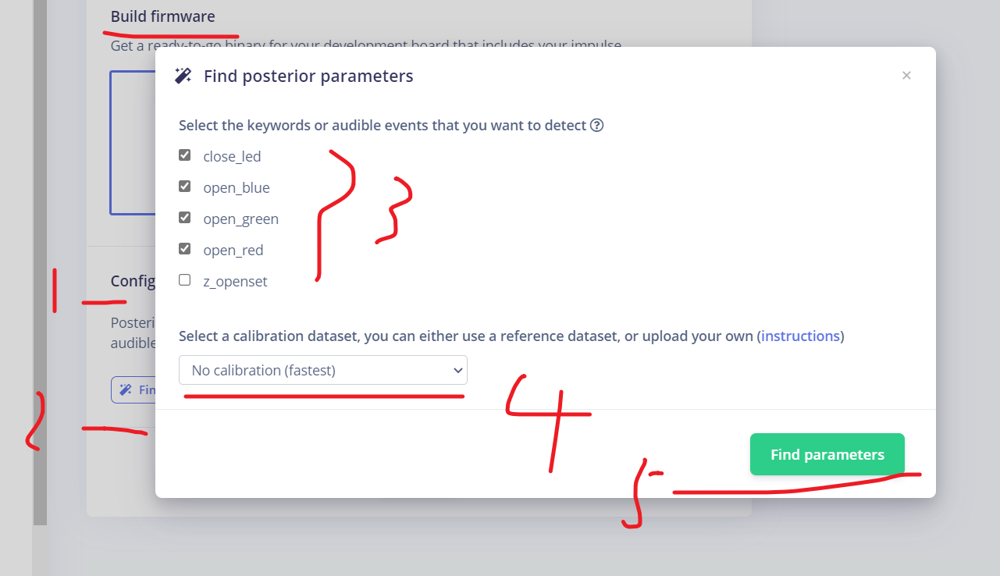

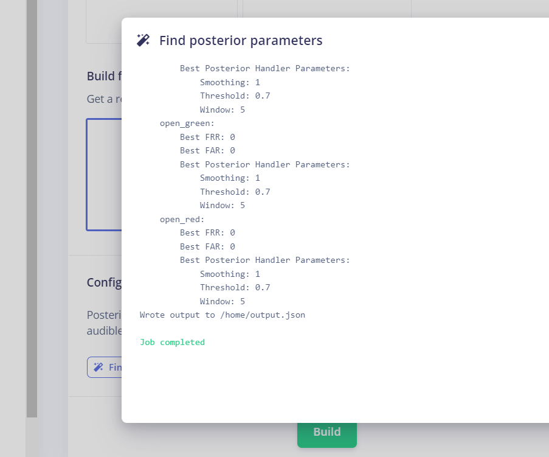

随后点击生成-Build，如图所以

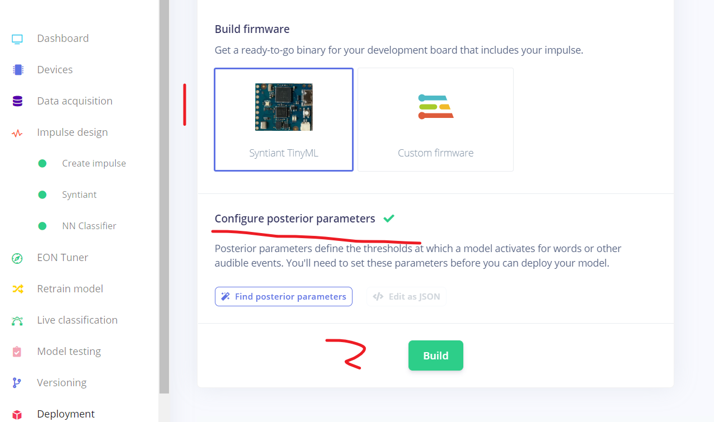

下载生成的模型之后点击运行falsh_windows.bat文件即可（默认已经安装arduino-cli）

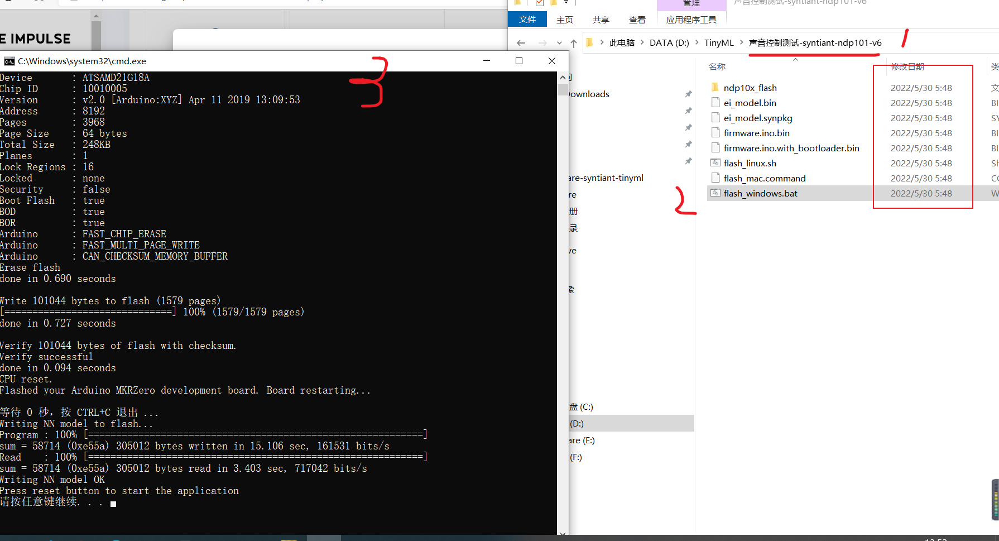

实验结果-使用野火串口调试助手-波特率115200

```
Predictions:
    close_led: 	0
    open_blue: 	1
    open_green: 	0
    open_red: 	0
    z_openset: 	0

Predictions:
    close_led: 	0
    open_blue: 	0
    open_green: 	0
    open_red: 	0
    z_openset: 	1

Predictions:
    close_led: 	0
    open_blue: 	1
    open_green: 	0
    open_red: 	0
    z_openset: 	0

Predictions:
    close_led: 	1
    open_blue: 	0
    open_green: 	0
    open_red: 	0
    z_openset: 	0

Predictions:
    close_led: 	0
    open_blue: 	0
    open_green: 	0
    open_red: 	0
    z_openset: 	1

Predictions:
    close_led: 	0
    open_blue: 	0
    open_green: 	0
    open_red: 	1
    z_openset: 	0

Predictions:
    close_led: 	0
    open_blue: 	0
    open_green: 	0
    open_red: 	0
    z_openset: 	1
```


##### 4.2、以下步骤是为了生成Syntiant NDP101 library库之后自动下载一个文件：projectname-syntiant-ndp101-lib-vx的文件，可用于自定义的功能实现


生成的projectname-syntiant-ndp101-lib-vx包含一个模型参数文件夹和两个文件

模型参数文件夹：model-parameters，此文件夹包含三个文件：dsp_blocks.h 和 model_metadata.h


两个文件：ei_model.bin 和 ei_model.synpkg。


生成的lib库使用方法：

将model-parameters文件夹的内容替换已经构建arduino工程:

firmware-syntiant-tinyml工程的src文件下的model-parameters需要将sp_blocks.h model_metadata.h和model_variables.h文件放入自定义固件构建目录的* src/model-parameters* 文件夹中）

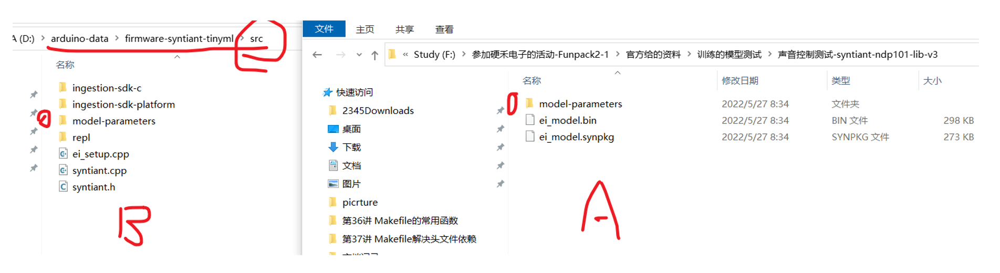

但是也要注意修改firmware-syntiant-tinyml工程的src文件下model_variables.h这个头文件。

```c++
//这个是我的edge-impulse工程生成的lib库文件中的model_variables.h文件
#ifndef _EI_CLASSIFIER_MODEL_VARIABLES_H_
#define _EI_CLASSIFIER_MODEL_VARIABLES_H_

#include <stdint.h>
#include "model_metadata.h"

//此语句对照平常的模型训练生成的库文件是没有的，不注释编译的会会报错，没安装edge-impulse-sdk这个软件包
//#include "edge-impulse-sdk/classifier/ei_model_types.h"  
//主要是看这个label是否已经改变和参数使用已经改变
const char* ei_classifier_inferencing_categories[] = { "close_led", "open_blue", "open_green", "open_red", "z_openset" };

uint8_t ei_dsp_config_9_axes[] = { 0 };
const uint32_t ei_dsp_config_9_axes_size = 1;
ei_dsp_config_audio_syntiant_t ei_dsp_config_9 = {
    1,
    1,
    0.032f,
    0.024f,
    40,
    512,
    0,
    0,
    0.96875f
};

// 同样对应的注释掉下面的语句-
//const ei_model_performance_calibration_t ei_calibration = {
//   1, /* integer version number */
//    (int32_t)(EI_CLASSIFIER_RAW_SAMPLE_COUNT / ((EI_CLASSIFIER_FREQUENCY > 0) ? EI_CLASSIFIER_FREQUENCY : 1)) * 1000, /* Model window */
//    0.8f, /* Default threshold */
//    (int32_t)(EI_CLASSIFIER_RAW_SAMPLE_COUNT / ((EI_CLASSIFIER_FREQUENCY > 0) ? EI_CLASSIFIER_FREQUENCY : 1)) * 500, /* Half of model window */
//    0   /* Don't use flags */
//};

#endif // _EI_CLASSIFIER_MODEL_METADATA_H_
```

##### 	4.2.1、自定义修改的代码部分-我使用的是vscode编辑和查看的源码，使用arduino编译和上传到开发板-建议看看源码，有很大修改的空间

```c++
//firmware-syntiant-tinyml.ino文件
void on_classification_changed(const char *event, float confidence, float anomaly_score) 
{
    static int8_t count = 0;
    // here you can write application code, e.g. to toggle LEDs based on keywords
    //您可以在此处编写应用程序代码，例如根据关键字切换LED
    if (strcmp(event, "open_blue") == 0) 
    { 
        if (count != 1)   // 如果此时LED灯不是蓝灯亮起。关闭所有LED灯之后重新打开蓝色LED灯
        {
            digitalWrite(LED_RED, LOW);
            digitalWrite(LED_GREEN, LOW);
            digitalWrite(LED_BLUE, LOW);
        }
        digitalWrite(LED_BLUE, HIGH);
        count = 1;
        Serial.println("open_green:open blue led");
    }
    else if (strcmp(event, "open_green") == 0) 
    {
        if (count != 2)// 如果此时LED灯不是绿亮起。关闭所有LED灯之后重新打开绿色LED灯
        {
            digitalWrite(LED_RED, LOW);
            digitalWrite(LED_GREEN, LOW);
            digitalWrite(LED_BLUE, LOW);
        }
        digitalWrite(LED_GREEN, HIGH);
        count = 2;
        Serial.println("led status:open green led");
    }
    else if (strcmp(event, "open_red") == 0)
    {
        if (count != 3)
        {
            digitalWrite(LED_RED, LOW);
            digitalWrite(LED_GREEN, LOW);
            digitalWrite(LED_BLUE, LOW);
        }
        digitalWrite(LED_RED, HIGH);
        count = 3;
        Serial.println("led status:open red led");
    }
    else if (strcmp(event, "close_led") == 0)
    { 
          digitalWrite(LED_RED, LOW);
          digitalWrite(LED_GREEN, LOW);
          digitalWrite(LED_BLUE, LOW);
          count = 4;
          Serial.println("led status:close all led!");
    }
}

void setup(void)
{
    syntiant_setup();  //syntiant硬件和软件初始化函数
}

void loop(void)
{
    syntiant_loop(); //syntiant的软件功能实现，自定义可在该函数里面实现
}
```

随后可以将自己的项目的模型通过arduino编译上传到开发板里面了。如图所示

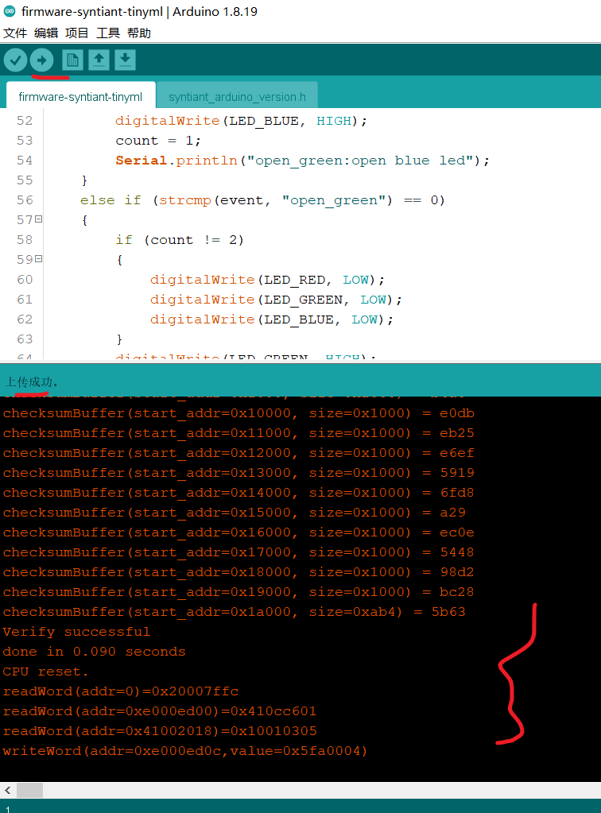

串口测试效果，波特率-115200

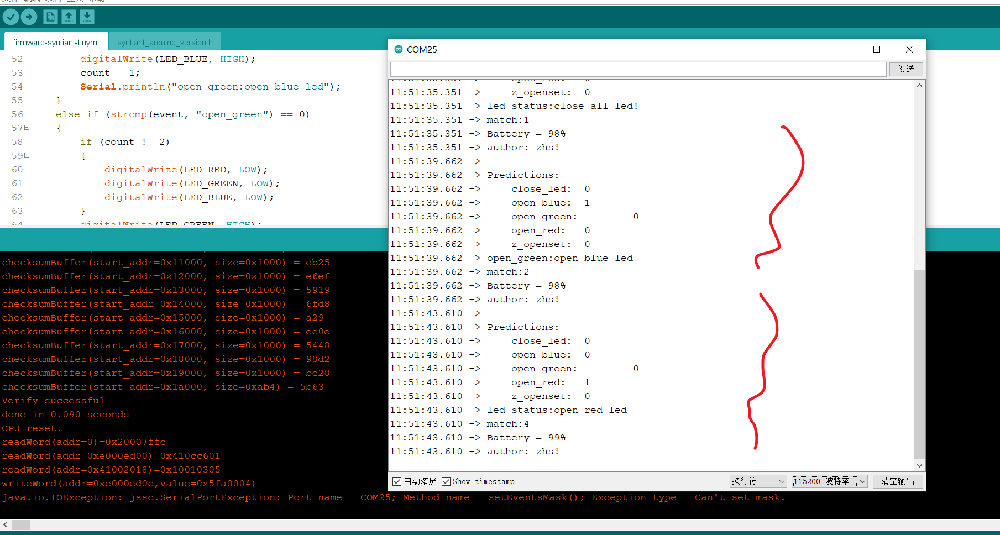

##### 4.2.2、同时也可以使用flash下载的方式编译上传自定义的代码到开发板里面

​	参考教程：https://docs.edgeimpulse.com/docs/deployment/running-your-impulse-locally/on-your-syntiant-tinyml-board  下载运行自己训练的模型

​	1、自定义代码后，获取Arduino输出的.bin文件并将其重命名为 firmware.ino.bin，arduino生成的.bin文件在C:\Users\Administrator\AppData\Local\Temp\arduino_build_xxxx，如图所示

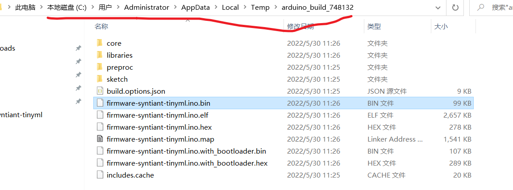

​	2、将firmware-syntiant-tinyml.ino.bin文件复制一份并且修改成firmware.ino.bin，放入之前生成的模型训练的syntiant的固件包中，使用flash方式下载到开发板中，如图所示

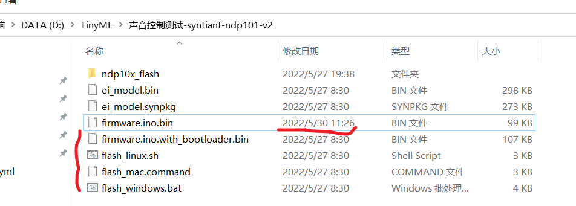

这个firmware.ino.bin是重新命名的。可以点击flash_windows.bat进行下载固件。

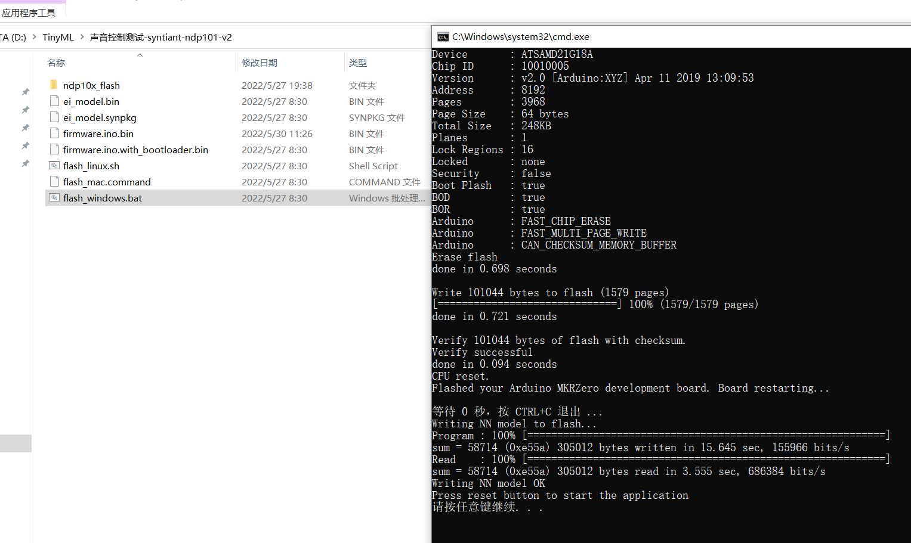

串口输出的实验结果

```
setup done
Loaded configuration
Inferencing settings:
	Interval: 0.0625 ms.
	Frame size: 15488
	Sample length: 968 ms.
	No. of classes: 5
Starting inferencing, press 'b' to break

Predictions:
    close_led: 	0				//识别此标签的语音之后match=1
    open_blue: 	0				//识别此标签的语音之后match=2
    open_green: 	0			//识别此标签的语音之后match=3
    open_red: 	0				//识别此标签的语音之后match=4
    z_openset: 	1				//识别此标签的语音之后match=5
match:5							//显示当前识别的关键词序号
Battery = 98%    				//显示电池电量
author: zhs!					//自定义的信息

Predictions:
    close_led: 	0
    open_blue: 	0
    open_green: 	1
    open_red: 	0
    z_openset: 	0
led status:open green led
match:3							//代表当前识别的语音关键词是是“开启绿灯” 标签为open_green
Battery = 99%
author: zhs!

Predictions:
    close_led: 	1
    open_blue: 	0
    open_green: 	0
    open_red: 	0
    z_openset: 	0
led status:close all led!
match:1
Battery = 98%
author: zhs!

Predictions:
    close_led: 	0
    open_blue: 	0
    open_green: 	0
    open_red: 	0
    z_openset: 	1
match:5
Battery = 98%
author: zhs!
```

