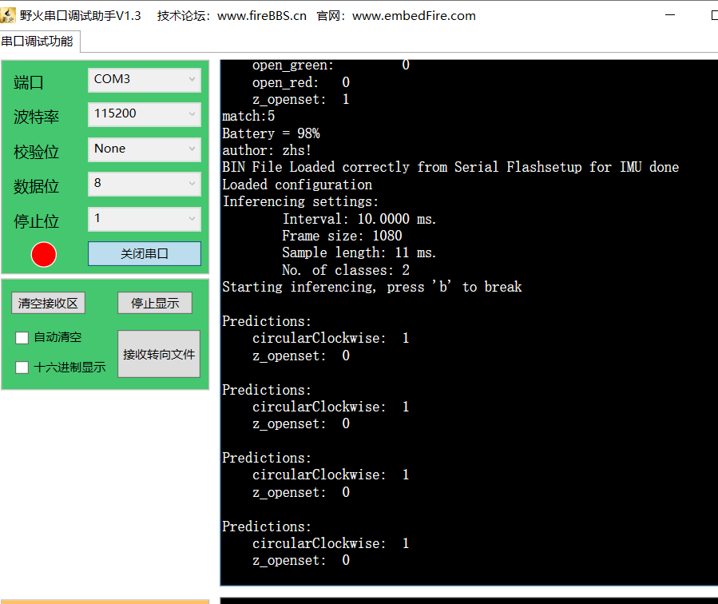

## Syntiant-tiny运动识别实验

**参考教程**

[1]: https://docs.edgeimpulse.com/docs/development-platforms/officially-supported-mcu-targets/syntiant-tinyml-board	"Syntiant Tiny ML Board"
[2]: https://docs.edgeimpulse.com/docs/tutorials/hardware-specific-tutorials/motion-recognition-syntiant#5.-deploying-to-your-device	"Motion recognition - Syntiant-运动识别syntiant开发板"
[3]: https://docs.edgeimpulse.com/docs/edge-impulse-studio/data-acquisition	"数据采集"
[4]: https://docs.edgeimpulse.com/docs/edge-impulse-cli/cli-uploader	"关于使用cli进行数据上传"
[5]: https://wiki.seeedstudio.com/cn/Wio-Terminal-TinyML-EI-1/	"Wio Terminal Edge Impulse 入门"

## 使用过程

1、下载官网给的IUM固件，随后刷入开发板之后进行测试，打开CMD命令框

输入：启动该模型

```
edge-impulse-run-impulse
```

随后会出现

```
C:\Users\Administrator>edge-impulse-run-impulse
Edge Impulse impulse runner v1.14.13
[SER] Connecting to COM3
[SER] Serial is connected, trying to read config...
[SER] Retrieved configuration
[SER] Device is running AT command version 1.6.0
[SER] Started inferencing, press CTRL+C to stop...
LSE
Inferencing settings:
        Interval: 10.0000 ms.
        Frame size: 1080
        Sample length: 11 ms.
        No. of classes: 2
Starting inferencing, press 'b' to break
>
Predictions:
    circularClockwise:  0
    z_openset:  1

Predictions:
    circularClockwise:  1
    z_openset:  0

Predictions:
    circularClockwise:  1
    z_openset:  0
```



运动过程一样要水平运动开发板，


学习这个案例遇到的问题

##### 1、使用开发上传运动数据失败

从命令提示符或终端运行：

```
edge-impulse-daemon
```

注意：当连接到新设备时

```
请运行 edge-impulse-daemon --clean 以删除以前的缓存。
```

运算上传运动数据会报错

```
[WS ] Incoming sampling request {
  path: '/api/training/data',
  label: 'circual',
  length: 5000,
  interval: 10,
  hmacKey: 'c1db9d77d28daafac41d1d179524dc6d',
  sensor: 'Inertial'
}
[SER] Configured upload settings
[SER] Sampling started
[SER] Sampling done
[SER] Sampling failed ERR: SD creating file failed
[WS ] Failed to sample data ERR: SD creating file failed
```

暂时搁置!

##### 2、安装NodeJS教程

​	解决方法：看相关文档-NodeJS安装和遇到的问题
