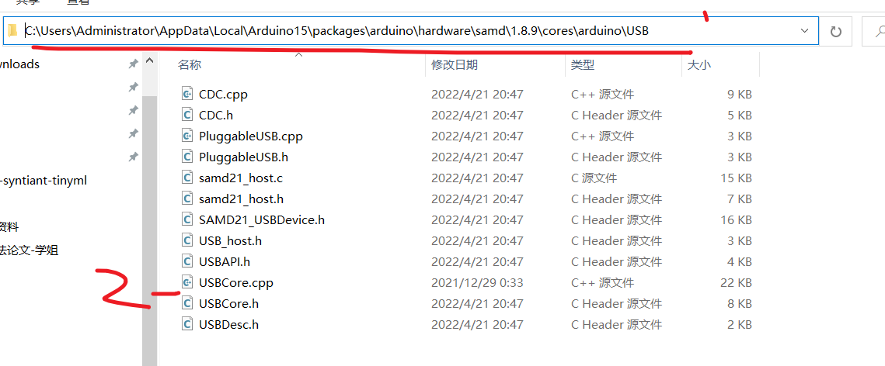
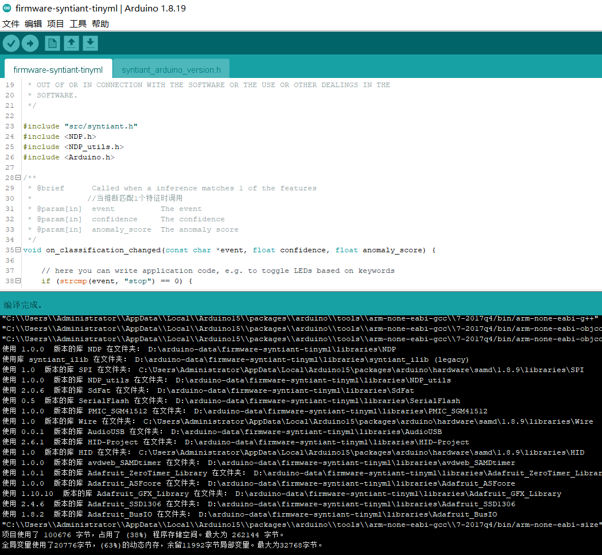

# syntiant TinyML board的源代码地址

参考资料：https://github.com/edgeimpulse/firmware-syntiant-tinyml

主要是是看firmware-syntiant-tinyml文件的README.md文件

### 1、搭建开发文件包-默认arduino环境都搭建好了，并且也安装了arduino-cli。

1.  ##### 建立一个arduino的工程文件-工程文件名字firmware-syntiant-tinyml 

    

2.  ##### mac和linux版本的自己按照firmware-syntiant-tinyml-master中的README.md文件尝试。-此搭建过程也是基于这个readme.md文件的

    1.  自动安装 点击运行 update_libraries_windows.bat 脚本安装Arduino库，arduino-cli的版本要大于0.13

        此处给arduino-cli的下载地址：https://github.com/arduino/arduino-cli/releases

        打开firmware-syntiant-tinyml.ino 文件，打开 Arduino IDE。 选择arduino MKRZero作为目标开发板，并编译/上传。

    2.  手动安装

        1.在firmware-syntiant-tinyml文件夹下建立一个libraries文件夹，把同一个文件夹目录下的文件夹lib的文件复制到libraries下，

        ```
        或者说将以下库安装为Zip库: 随后按照arduino添加库文件那样添加也可以 
        lib / Adafruit_ASFcore  
        lib / PMIC_SGM41512  
        lib / AudioUSB  
        lib /NDP 
        lib / NDP_utils  
        lib / SerialFlash  
        lib / syntiant_ilib 
        ```

        2.使用Arduino库管理器安装以下库(使用确切版本): 

        ```
        //库名字@版本号
        avdweb_SAMDtimer@1.0.0  
        Adafruit ZeroTimer Library@1.0.1  
        Adafruit BusIO@1.8.2  
        Adafruit GFX Library@1.10.10  
        Adafruit SSD1306@2.4.6  
        HID-Project@2.6.1    //（nicohood / HID-Project   ，这个我没找到再库文件里）
        SdFat@2.0.6  
        ```

        3.将Arduino USBCore driver的usb驱动复制到SAMD包文件夹里

        具体：将lib/Arduino USBCore driver/USBCore.cpp文件复制到 ：用户/自己的window用户名/AppData/Local/Arduino15/packages/arduino/hardware/samd/1.8.9/cores/arduino/USB/

        
        
        这样环境就搭建好了，可以开始编译文件了效果如下

    


### 2、官方原文资料安装源码

## Config build and flash

This project uses the `arduino-cli` compiler to build & flash new firmware. Windows users also need Arduino IDE (tested with v1.8.15).


### Usage - macOS and Linux

The script will verify if all needed libraries and the samd core is installed and install them if needed. If you prefer to do this 
step manually, follow the step in the next chapter.

For building the project use:

```
./arduino-build.sh --build
```

For flashing use:

```
./arduino-build.sh --flash
```

You can also do both by using:

```
./arduino-build.sh --all
```


### Usage - Windows

* Run `update_libraries_windows.bat` script to install Arduino libraries.

* Open the `firmware-syntiant-tinyml.ino` with the Arduino IDE. Select MKRZero as board target and compile/upload.


## Setup Manually

* Install Board package SAMD v1.8.9

* Install following libraries using Arduino Library manager (use exact versions):
    * avdweb_SAMDtimer@1.0.0
    * Adafruit ZeroTimer Library@1.0.1
    * Adafruit BusIO@1.8.2
    * Adafruit GFX Library@1.10.10
    * Adafruit SSD1306@2.4.6
    * nicohood/HID-Project@2.6.1
    * SdFat@2.0.6

* Install the following libraries as a Zip library:
    * lib/Adafruit_ASFcore
    * lib/PMIC_SGM41512
    * lib/AudioUSB
    * lib/NDP
    * lib/NDP_utils
    * lib/SerialFlash
    * lib/syntiant_ilib

* Patch the _Arduino USBCore driver_: copy `lib/Arduino USBCore driver/USBCore.cpp` in SAMD package folder (ie: /Users/[USER]/Library/Arduino15/packages/arduino/hardware/samd/1.8.9/cores/arduino/USB/)

