# 搭建syntiant-tinyml语音识别实验的环境-记录

参考教程：[基于最新理念TinyML – B0板子下载官方go-stop模型软件（第2讲) - 哔哩哔哩 (bilibili.com)](https://www.bilibili.com/read/cv13301956?spm_id_from=333.999.0.0)

[Syntiant Tiny ML Board - Edge Impulse Documentation](https://docs.edgeimpulse.com/docs/development-platforms/officially-supported-mcu-targets/syntiant-tinyml-board) 官方给的教程需要安装那些，但是第二个edge-impulse-cli是针对运动识别需要的软件，语音识别不需要安装

以下是我搭建环境的记录过程，并非全部的安装过程！

##### 1、搭建arduin-cli

​	使用arduino-cli的版本**选择使用0.13或者其他版本**可以解决以下问题，使用0.21有问题会出现两种问题

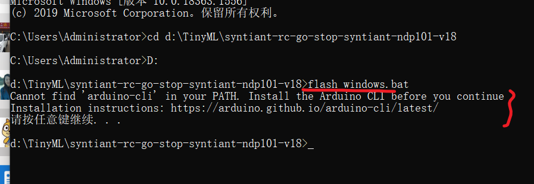

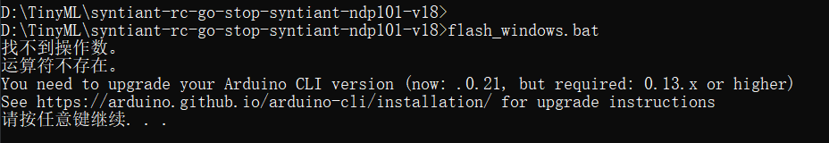

解决方法：重新安装arduino的其他版本即可，我使用的是arduino-cli 20版本

下载地址：

[Releases · arduino/arduino-cli (github.com)](https://github.com/arduino/arduino-cli/releases)

[arduino/arduino-cli: Arduino command line tool (github.com)](https://github.com/arduino/arduino-cli)

##### 2、安装arduino-cli之后设置的文件夹名称为xxx\arduino-cli的名字

```
例如：E:\Program Files (x86)\arduino-1.8.19-windows\arduino-cli
```

​	配置环境参数

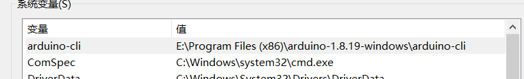

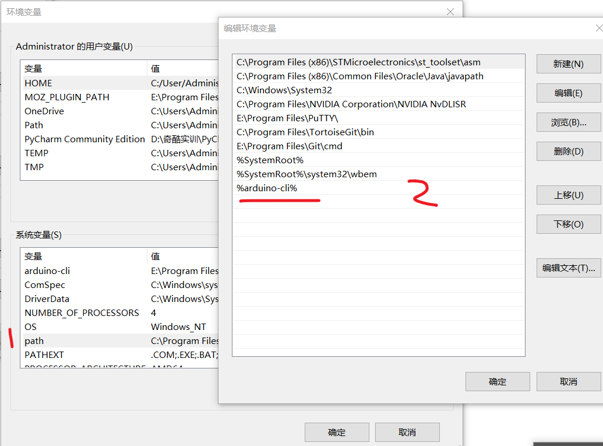

##### 3、配置之后，使用cmd命令行测试是否可以使用：arduino-cli board list。使用之前开发板连接电脑，并且在控制面板可以查看端口号

```c
C:\Users\Administrator>arduino-cli board list
Port  Protocol Type              Board Name      FQBN                 Core
COM25 serial   Serial Port (USB) Arduino MKRZERO arduino:samd:mkrzero arduino:samd

```

##### 4、第一次运行falsh_windows.bat,我有很多未安装的arduino的包和组件


解决方法：第一次安装失败正常，多安装几次即可。跟着上面的教程安装即可！随后我会把我的软件整理打包分享

##### 5、下载开发板库文件失败，-Arduino SAMD Boards (32-bit ARM Cortex-M0+)

```
 下载 http://downloads.arduino.cc/tools/gcc-arm-none-eabi-7-2017-q4-major-win32-arduino1.zip 时出错
java.lang.RuntimeException: java.lang.Exception: 下载 http://downloads.arduino.cc/tools/gcc-arm-none-eabi-7-2017-q4-major-win32-arduino1.zip 时出错
	at cc.arduino.contributions.packages.ui.ContributionManagerUI.lambda$onInstallPressed$2(ContributionManagerUI.java:179)
	at java.lang.Thread.run(Thread.java:748)
Caused by: java.lang.Exception: 下载 http://downloads.arduino.cc/tools/gcc-arm-none-eabi-7-2017-q4-major-win32-arduino1.zip 时出错
	at cc.arduino.contributions.DownloadableContributionsDownloader.download(DownloadableContributionsDownloader.java:145)
	at cc.arduino.contributions.DownloadableContributionsDownloader.download(DownloadableContributionsDownloader.java:79)
	at cc.arduino.contributions.DownloadableContributionsDownloader.download(DownloadableContributionsDownloader.java:56)
	at cc.arduino.contributions.packages.ContributionInstaller.install(ContributionInstaller.java:108)
	at cc.arduino.contributions.packages.ui.ContributionManagerUI.lambda$onInstallPressed$2(ContributionManagerUI.java:172)
	... 1 more
Caused by: java.net.SocketException: Software caused connection abort: recv failed
	at java.net.SocketInputStream.socketRead0(Native Method)
	at java.net.SocketInputStream.socketRead(SocketInputStream.java:116)
	at java.net.SocketInputStream.read(SocketInputStream.java:171)
	at java.net.SocketInputStream.read(SocketInputStream.java:141)
	at java.io.BufferedInputStream.read1(BufferedInputStream.java:284)
	at java.io.BufferedInputStream.read(BufferedInputStream.java:345)
	at sun.net.www.MeteredStream.read(MeteredStream.java:134)
	at java.io.FilterInputStream.read(FilterInputStream.java:133)
	at sun.net.www.protocol.http.HttpURLConnection$HttpInputStream.read(HttpURLConnection.java:3444)
	at sun.net.www.protocol.http.HttpURLConnection$HttpInputStream.read(HttpURLConnection.java:3437)
	at cc.arduino.utils.network.FileDownloader.readStreamCopyTo(FileDownloader.java:251)
	at cc.arduino.utils.network.FileDownloader.openConnectionAndFillTheFile(FileDownloader.java:230)
	at cc.arduino.utils.network.FileDownloader.downloadFile(FileDownloader.java:176)
	at cc.arduino.utils.network.FileDownloader.download(FileDownloader.java:125)
	at cc.arduino.contributions.DownloadableContributionsDownloader.download(DownloadableContributionsDownloader.java:143)
	... 5 more

```

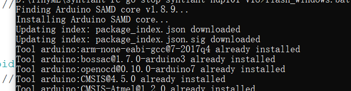

解决方法：

[1]: https://blog.csdn.net/u012388993/article/details/112292974	"Arduino常用的附加开发版管理器网址"
[2]: http://t.csdn.cn/6zVE6	"arduino开发板包默认安装在哪里？安装目录分析"
[3]: https://blog.csdn.net/qq_19734597/article/details/116226429	"ESP8266 Arduino 解决开发板管理器下载开发包失败和速度慢的方法"
[4]: http://t.csdn.cn/M1DU7	"ArduinoIDE 安装开发板依赖下载失败的情况 ESP8266"
[5]: http://t.csdn.cn/49h2U	"Arduino Board Manager stm32duino下载失败的解决方法"
[6]: https://blog.csdn.net/weixin_41255234/article/details/113483408	"Arduino IDE 离线安装自定义开发板 / 附加开发板下载时出错 解决方法"

##### 6、下载运行官方给的go-stop模型，运行flash_windows.bat文件但是出现卡死的现象-Writing NN model to flash....

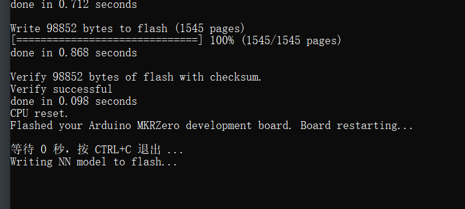

解决方法：换一个新生成的模型-syntiant-rc-go-stop-syntiant-ndp101-v41 换成这个版本就可以了

##### 7、烧录错误问题

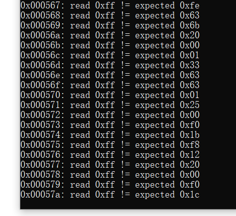

解决方法：

​	串口发  :F 就能解决，使用正点原子或者其他的串口调试助手输入！，Tera term串口助手不显示" ： "这个字符

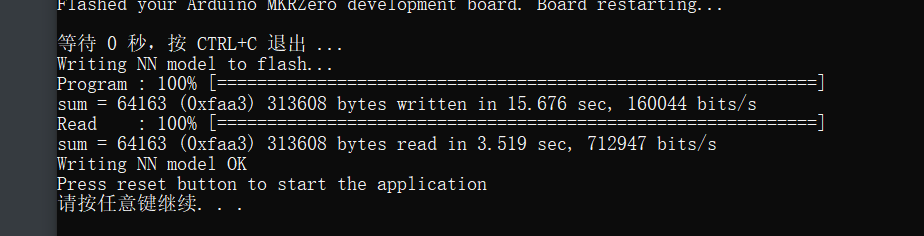

##### 8、遇见一些问题，这个训练模型中，一些其他的杂音也会引起响应和go的语音指令相同的效果

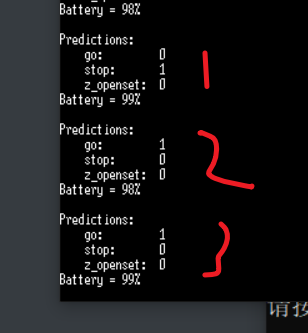

​	影响因素：

​	1、是我说stop的响应

​	2、是我说go的响应

​	3、是我随意拍手造成的误响应

问题待解决：

客服建议：1、只说训练不行，训练集需要做到覆盖性，需要不同环境下，不同语速，不同声调说100遍。

​					2、想好要说的内容：“syntiant，打开红灯”syntiant“，打开绿灯”之类的，整简单点的啊，三个汉字多好，红 绿 蓝"

​					3、聊天群大佬给的建议

​		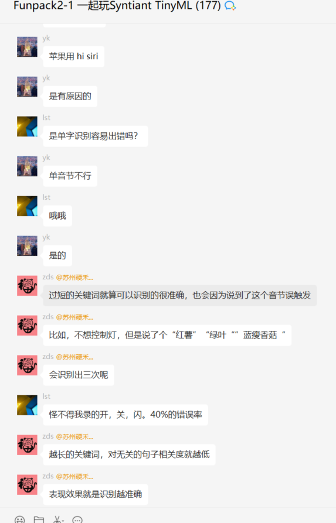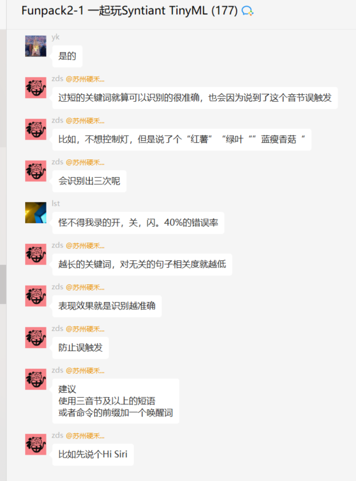


